<br><br>

<!-- project philosophy -->


> HOME OF PETS!  
> Paws, an ensemble of innovative platforms that revolutionizes pet care by integrating a Live Tracker device, infusing AI-driven dialogue and real-time chat, crafting machine learning searches for lost companions, nurturing pet adoption, and curating a dedicated shop for pet essentials and beyond.

### User Stories

- As a prospective pet owner, I want a comprehensive platform that allows me to explore all available pets for adoption and also provides a shopping section for pet-related items, so that I can both welcome a new pet into my home and adequately provide for its needs.
- As a shopper I want to be able to chat with someone to help me with my inquiries so that I can choose the products I need for my pet.
- As a person who found a lost pet I want a portal where I can report it so that it can be found

### Pet Owner Stories

- As a pet owner I want a tracker device to put on my dog’s collar so that I can track him on a portal if it gets lost.
- As a pet owner who lost a pet I want a portal where I can search for my pet by uploading its image so that I can find it.
- As a pet owner I want to be able to chat with someone who will be able to answer questions about my pet 24/7 so that I can keep my pet healthy and happy.

### Admin Stories

- As an admin, I want the capability to manage the inventory of products and add pets for listing on the adoption platform, so that I can efficiently track product availability and provide users with an updated and accessible selection of pets for adoption.
- As an admin I want to approve or reject adoption requests so that I can make sure the pets are going to a safe place.
- As an admin I want to be able to chat with the users of the website in real-time.

<br><br>

<!-- Tech stack -->


### Paws harnesses a diverse range of technologies, each playing a crucial role in delivering a robust and versatile application:

Core Technologies:

- [React](https://react.dev/): Employed React for building the website's user interface, offering a dynamic and responsive experience.
- [Node.js](https://nodejs.org/en): Serves as the backbone for the backend operations of both the website and mobile application, ensuring efficient data handling and server-side functionality.
- [Express.js](https://expressjs.com/): Integrated with Node.js, Express.js streamlines the development of web applications by providing a robust set of features for web and mobile applications.
- [Electron.js](https://www.electronjs.org/): Utilized for crafting the desktop application, Electron.js enables the creation of native desktop applications using web technologies.
- [React Native](https://reactnative.dev/): Adopted for developing the mobile application, React Native allows for a seamless cross-platform mobile experience.
- [MongoDB](https://www.mongodb.com/): Acts as the primary database for the website and desktop application, offering a scalable, high-performance data storage solution.
- [MySQL](https://www.mysql.com/): Used for the mobile application's database, ensuring reliable data management and storage.
- [Python](https://www.python.org/): The backbone of my machine learning model, providing the necessary computational power and flexibility for complex data analysis.
- [Flask](https://flask.palletsprojects.com/en/3.0.x/): Works in tandem with Python to host the machine learning model, making it accessible from the website and mobile application through TensorFlow and TensorFlow Hub.
- [C++](https://cplusplus.com/): Employed for programming the ESP8266, enabling the integration and control of hardware components.

Hardware Integration:

- [ESP8266](https://en.wikipedia.org/wiki/ESP8266#:~:text=The%20ESP8266%20is%20a%20low,Espressif%20Systems): A core component of my hardware setup, used for building a tracker in conjunction with a GPS module, offering real-time tracking capabilities and IoT functionality.
- [NEO-6M GPS Module](https://randomnerdtutorials.com/guide-to-neo-6m-gps-module-with-arduino/): Paired with the ESP8266, this GPS module is essential for providing precise location tracking capabilities, enhancing the functionality of my hardware solution.

Third-party Integrations:

- [Firebase](https://firebase.google.com/): for real-time live chat functionality, enhancing user engagement and support.
- [OpenAI](https://openai.com/): for AI-driven chat capabilities, offering intelligent and responsive user interactions.
- [TensorFlow.js](https://www.tensorflow.org/js): for executing the machine learning model in the browser and mobile application, harnessing the power of machine learning directly in the user interface.
- [Google Maps](https://developers.google.com/maps): for displaying pet locations, providing users with intuitive and accurate geolocation services.

<br><br>

<!-- UI UX -->


> The design process for Paws began with meticulous planning, utilizing Excalidraw for initial structuring of the project. This foundational step ensured a cohesive and well-organized structure. Subsequently, the project transitioned to Figma, where detailed wireframes and sophisticated mockups were meticulously crafted, laying the groundwork for a visually compelling and user-friendly design.

### Mockups

> Website

<table>
  <tr>
    <th>Home Page</th>
    <th>Lost reporting Page</th>
    <th>Shop Item Page</th>
  </tr>
  <tr>
    <td></td>
    <td></td>
    <td>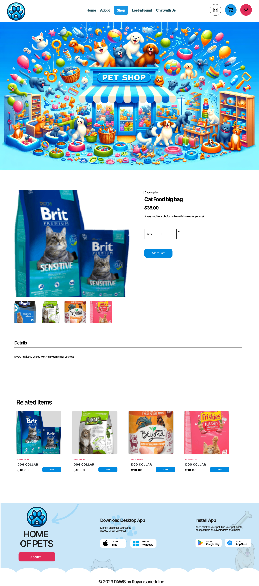</td>
  </tr>
</table>

- For more Figma designs: [figma](https://www.figma.com/file/Xro58VJPn7fgCsy8AM4sIU/Paws?type=design&node-id=1-3&mode=design&t=fGyvVWXXr1PSm0Ga-0)
  <br><br>

<!-- Database Design -->


### Database Design:

Paws is uniquely structured with a dual-database architecture to cater to the diverse needs of the platform. The project intelligently integrates two types of databases: MongoDB and MySQL, ensuring a robust and versatile data management system.

MongoDB: I employ MongoDB, a powerful NoSQL database, for my web platforms. This choice allows us to handle complex data structures with ease, providing high performance, high availability, and easy scalability. The flexible schema of MongoDB is perfectly suited for my web applications, allowing for rapid development and the ability to handle large volumes of unstructured data. Below is the ER diagram:

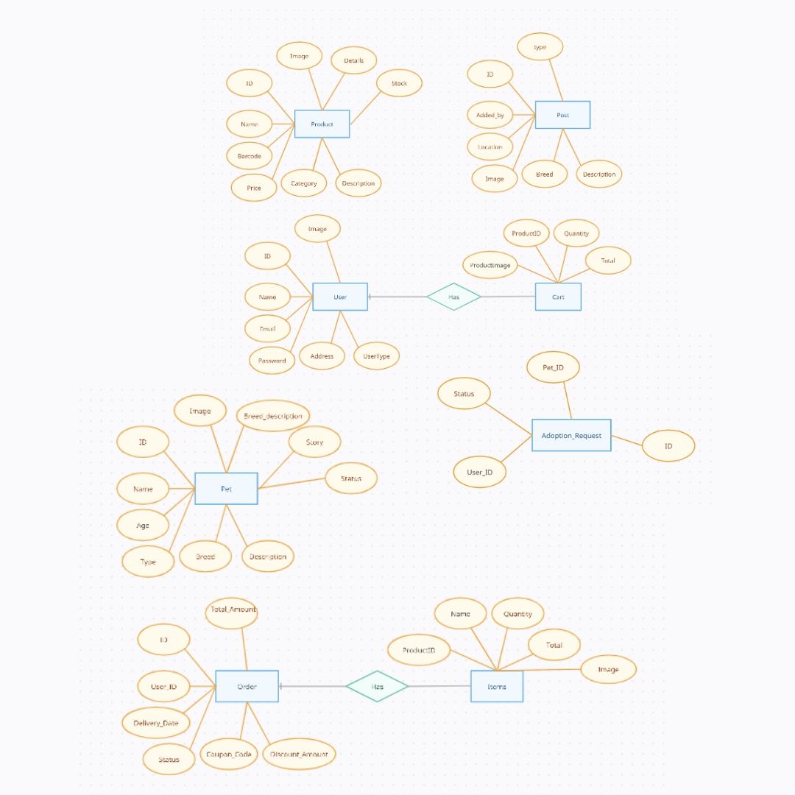

MySQL: For my mobile app platform, I rely on MySQL, a renowned open-source relational database management system. MySQL stands out for its reliability and is widely recognized for its performance and strong data protection features. By using MySQL for my mobile platform, I ensure that data is structured, consistent, and securely managed. Below is the ER diagram:

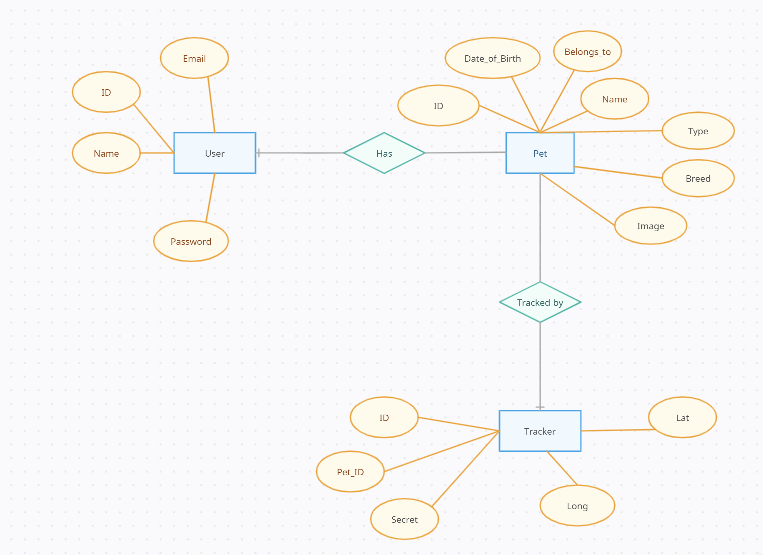

Together, these databases form the backbone of Paws, supporting my mission to deliver a seamless and efficient experience across both web and mobile platforms. Whether it's handling dynamic content on the web or ensuring data integrity in mobile applications, my dual-database architecture is designed to meet the diverse and evolving needs of my users.  
<br><br>

<!-- Implementation -->


> Guided by the meticulously designed wireframes and mockups, I developed the Paws website and desktop application, equipping them with an array of features. These enhancements were strategically integrated to ensure a seamless and enriched user experience, on the web, mobile and on the desktop platforms:

### User Pages (Web)

| Register Page  
| --------------------------------------------------------
| 

| Google Login  
| -----------------------------------------------------------
| 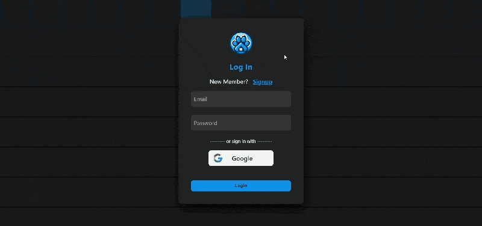

| Home Page  
| ------------------------------------------------
| 

| Adopt Main  
| ------------------------------------------------------------
| 

| Adopt Pets Page  
| -------------------------------------------------------
| 

| Adopt Process  
| ----------------------------------------------------------------
| 

| Shop Page  
| -------------------------------------------
| 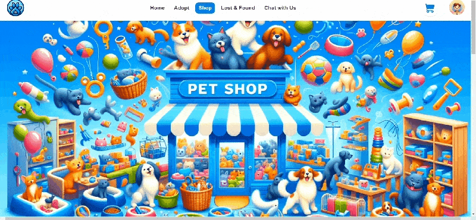

| Shop Process  
| -----------------------------------------------------------
| 

| Found Reporting  
| -------------------------------------------------------
| 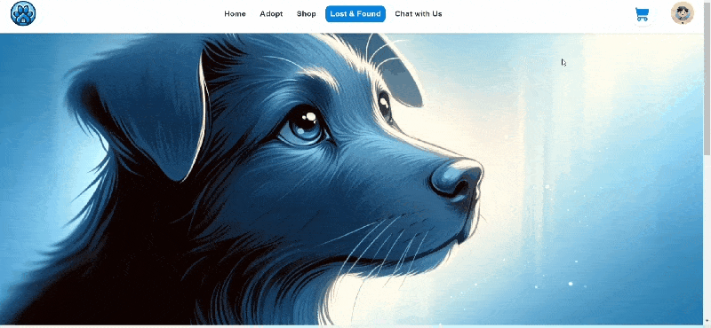

| Lost Reporting 1  
| -------------------------------------------------------------
| 

| Lost Reporting 2  
| --------------------------------------------------------------
| 

| Lost Reporting 3  
| -----------------------------------------------------------------
| 

| Chat Page  
| ------------------------------------------------
| 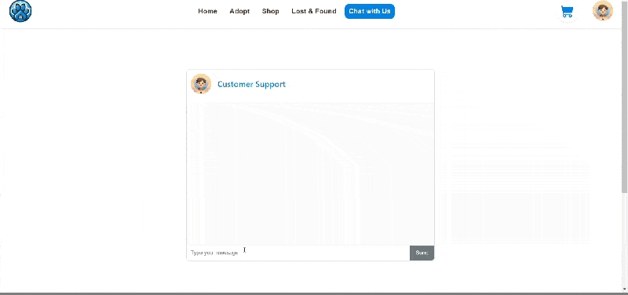

| Error Page  
| ------------------------------------------------
| 

### User Screens (App)

<table>
  <tr>
    <th>Onboarding Screen</th>
    <th>Login Screen</th>
     <th>Register Screen</th>
  </tr>
  <tr>
    <td>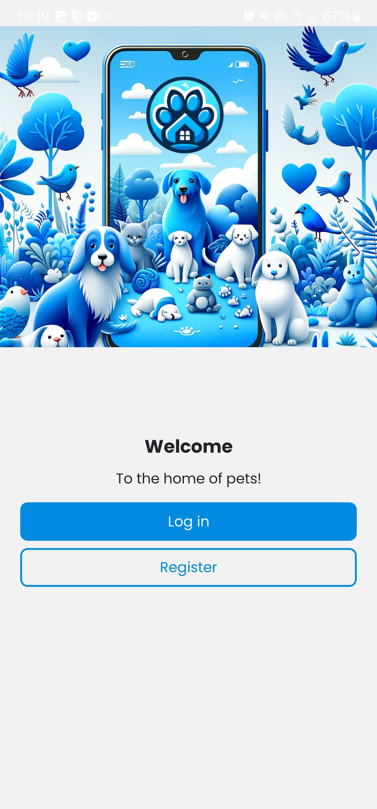</td>
    <td></td>
     <td></td>
  </tr>
</table>

<table>
  <tr>
    <th>Add Pet Screen</th>
    <th>Home Screen</th>
    <th>Tracker Screen</th>
  </tr>
  <tr>
    <td></td>
     <td></td>
    <td></td>
  </tr>
</table>

<table>
  <tr>
    <th>Chat Screen</th>
    <th>Profile Screen</th>
  </tr>
  <tr>
    <td>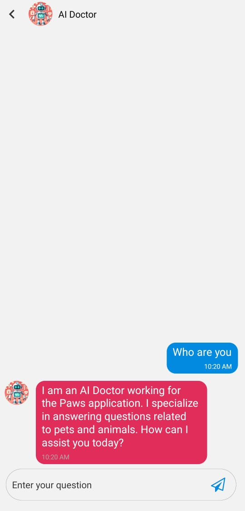</td>
    <td></td>
  </tr>
</table>

### Admin Pages (Desktop)

| Login Page                                              |
| ------------------------------------------------------- |
| 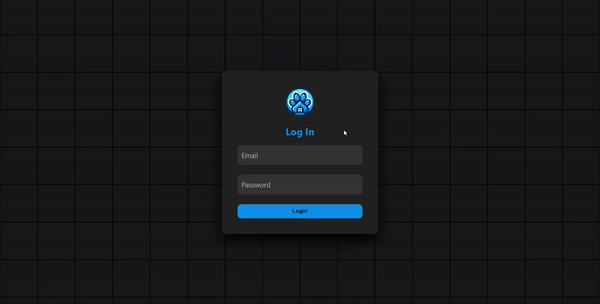 |

| Dashboard Page                                             | All Pets Page                                            |
| ---------------------------------------------------------- | -------------------------------------------------------- |
|  |  |

| Edit Pet Page                                            | Add Pet Page                                           |
| -------------------------------------------------------- | ------------------------------------------------------ |
| 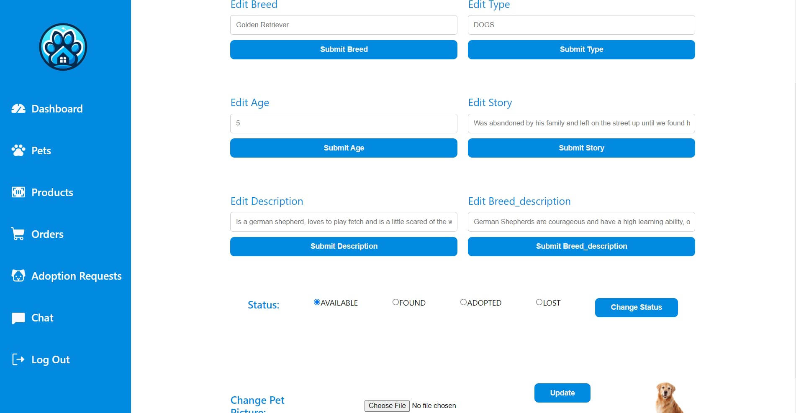 |  |

| All Products Page                                                | Add Product Page                                               |
| ---------------------------------------------------------------- | -------------------------------------------------------------- |
|  |  |

| All Orders Page                                              | Order Page                                         |
| ------------------------------------------------------------ | -------------------------------------------------- |
|  |  |

| Adoption Requests Page                                                     | Chat Page                                        |
| -------------------------------------------------------------------------- | ------------------------------------------------ |
|  | 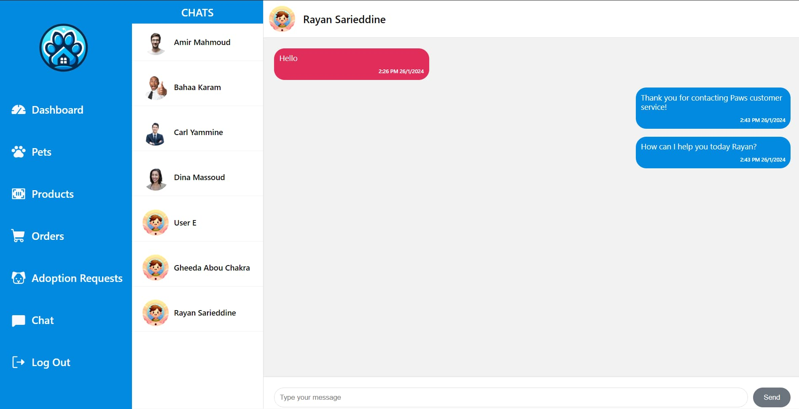 |

<br><br>

### Machine Learning (Breed Classification)

My machine learning model stands at the core of the Paws Project, adeptly categorizing 37 breeds of dogs and cats using a dataset specifically crafted for this purpose. It's a Convolutional Neural Network (CNN) employing transfer learning, with DenseNet121 as the base, finely tuned for my classification task. The model, trained through supervised learning on a labeled dataset, undergoes rigorous training and validation, incorporating data augmentation to enhance its robustness. It distinguishes itself by accurately predicting pet breeds, pivotal for identifying lost pets or reporting found ones on the web platform, and recognizing user pet breeds in the mobile app. This model is not just a component; it's the intelligence that powers the Paws Project.

- For more detailed information and a deeper dive into the model, its architecture, and its functionalities, please refer to: [Paws Machine Learning Process](./machine-learning/README.md).

| Training VS validation Accuracy Graph  
| -----------------------------------------
| 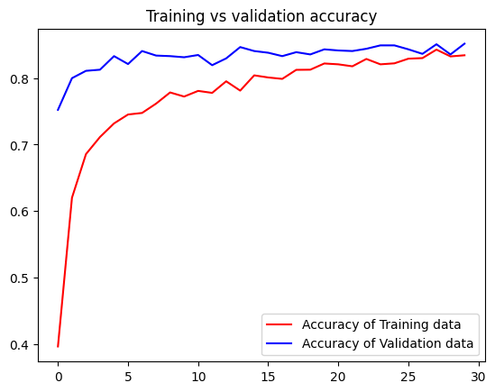

| Training VS Validation Loss Graph  
| -----------------------------------------
| 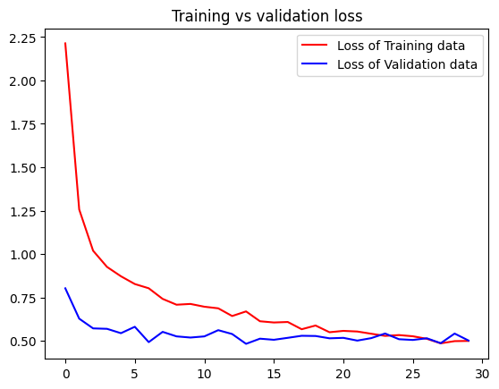

### Arduino (Live Tracker)

The Arduino-based pet tracker plays a pivotal role, as it employs an ESP8266 chip for WiFi connectivity and a Neo-6M-GPS module to fetch real-time location data. By interfacing these modules on a breadboard and programming them through Arduino IDE, we've crafted a seamless tracker. The system periodically transmits the pet's coordinates to my backend, ensuring each pet's location is meticulously logged in the "trackers" table of my database.  
For a more comprehensive understanding of the Arduino process and the code's intricacies, please refer to the detailed documentation: [Paws Live Tracker](./arduino/README.md).

<table>
  <tr>
    <th>Live Tracker</th>
 
  </tr>
  <tr>
    <td></td>
  </tr>
</table>

<!-- Prompt Engineering -->


### Prompt Engineering:

In this project, I harness the power of advanced prompt engineering to fine-tune the interactions with my natural language processing model, particularly within the Chat screen. Prompt engineering is not just about sending requests to the AI; it's an art and science that involves crafting well-structured and contextually rich input instructions to guide the model's responses more effectively and predictably.

"You are an AI Doctor working for the Paws application to answer questions only related to pets and animals."

This prompts is then sent to OpenAI's GPT model, ensuring that the AI's responses are not only relevant and informative but also adhere to the predefined role and context of the conversation.

Key aspects of my prompt engineering approach include:

1- Contextual Relevance: Ensuring that the prompt includes enough context from the conversation history to make the responses coherent and contextually appropriate.

2- Role Specification: Clearly defining the AI's character (role: AI Doctor) at the beginning of the conversation to guide its tone, style, and scope of responses.

3- Dynamic Interaction: Continuously updating the prompt with new messages, allowing the AI to maintain a natural and engaging conversation flow.

4- Precision and Efficiency: Carefully structuring prompts to elicit specific types of responses, enabling the AI to handle a variety of tasks effectively, from answering user inquiries to providing advice on pet care.

By leveraging these techniques, my Chat screen offers users a sophisticated and intuitive conversational experience, making their interactions with the AI not just a dialogue but a journey of discovery and assistance. Whether it's addressing pet health concerns or offering insights into animal behavior, my prompt engineering ensures that every response is a step towards a more informed and engaged user.

<br><br>

<!-- AWS Deployment -->


### AWS Integration:

This project not only emphasizes the meticulous crafting of code but also ensures its seamless deployment using AWS (Amazon Web Services). The deployment process involves a series of well-orchestrated steps, ensuring that the backend of my application is securely and efficiently hosted on an AWS EC2 instance:

- EC2 Instance Initialization

- Secure SSH Configuration with PuTTY

- Backend File Transfer Using SCP

  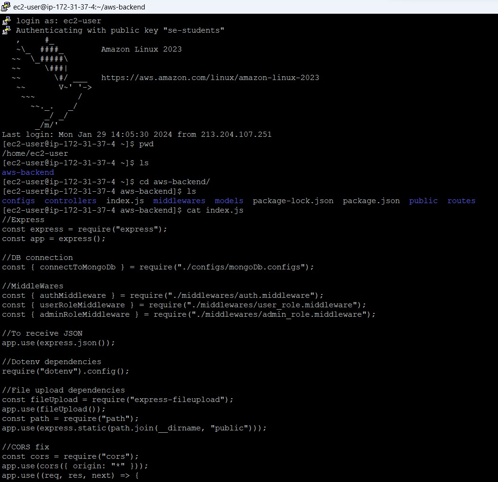

- Server Environment Setup for backend

  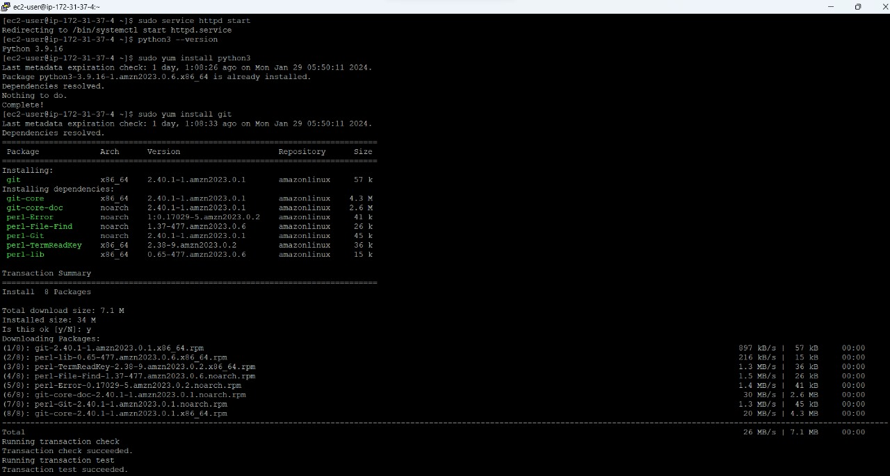

<br><br>

<!-- Unit Testing -->


### Unit Testing:

Throughout the development of Paws, The testing strategy was structured to incorporate thorough input validation and extensive API testing through Postman. This method offered immediate insights into the functionality and reliability of our endpoints. Further enhancing the robustness of our application, I integrated a deeper, automated layer of validation with comprehensive unit testing. This blend of manual and automated testing procedures fortified the foundation of Paws, ensuring the system's integrity and reliability of the tested endpoints.

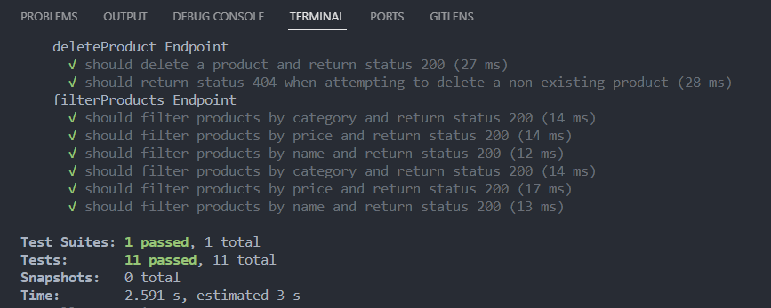
<br><br>

<!-- How to run -->


> To set up Paws locally, follow these steps:

### Prerequisites

Before you begin, ensure you have met the following requirements:

- Node.js and npm:
  ```sh
  npm install npm@latest -g
  ```
- Python for the Flask server:
  ```sh
  Install Python from the official website.
  ```
- XAMPP for the MySQL database:
  ```sh
  Install XAMPP from the official website.
  ```
- Arduino IDE for ESP8266
  ```sh
  Install Arduino IDE from the official website.
  ```

### Installation & Setup

Follow these steps to install and set up Paws on your local environment. The setup is divided into sections for the web platform, mobile app, and Arduino.

Clone the repo:

```sh
git clone https://github.com/Rayan-Sarieddine/paws
```

Web:

1- Start the Flask server for pet breed prediction:

```sh
cd flask
python app.py
```

2- Run the Node.js server (Ensure MongoDB Compass is open):

```sh
cd backend
nodemon .
```

3- Start the React app:

```sh
cd frontend
npm start
```

4- Launch the desktop app with Electron:

```sh
cd electron-app
npm run dev
```

Mobile App:

1- Start XAMPP and MySQL.

2- Run the Node.js server for the mobile app:

```sh
cd backend-app
nodemon .
```

3- Start the mobile application with Expo:

```sh
cd frontend-app
npx expo start
```

Note: Run ipconfig to verify the IP address matches the one set in the request file.  
Install Expo on your phone and scan the QR code (ensure the phone and desktop are connected to the same Wi-Fi).

Arduino:

1- If not already done, complete step 2 from the Mobile App section.  
2- Connect the Arduino (ESP8266) to your computer.  
3- Update the Wi-Fi credentials and API endpoint in the Arduino IDE code.  
4- Confirm the API in the Arduino code is targeting the correct IP address (use ipconfig).  
5- Upload the code.

Now, you should be able to run Paws locally and explore its features.
